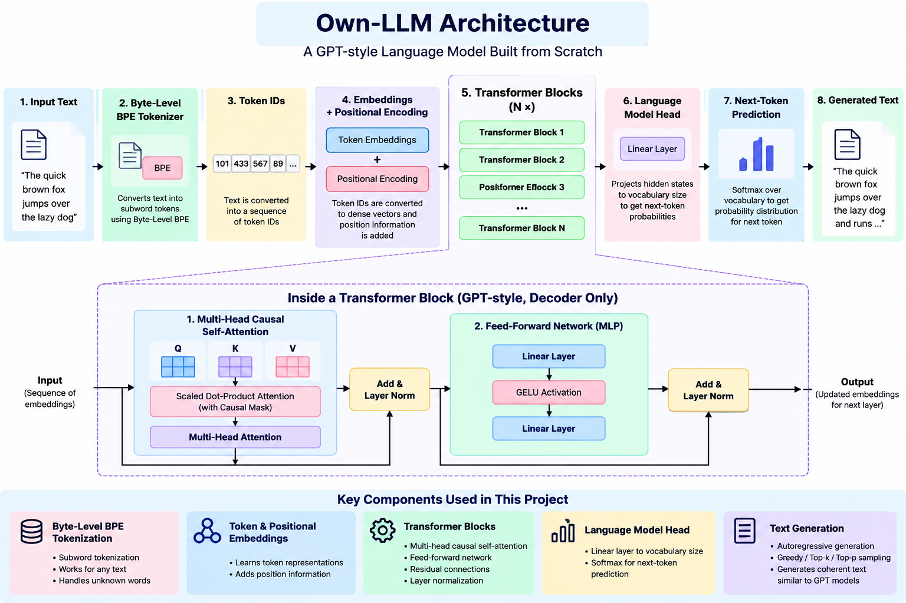

# Own-LLM

A small GPT-style language model built from scratch using PyTorch.

This project demonstrates the core components behind modern language models, including tokenization, embeddings, causal self-attention, multi-head attention, transformer blocks, training, evaluation, and text generation.

The model runs locally and does not require an external LLM API.

## Features

* Custom Byte-Level BPE tokenizer
* 1,000-token vocabulary
* Token embeddings
* Positional embeddings
* Causal self-attention
* Multi-head attention
* Transformer blocks
* Feed-forward networks
* Layer normalization
* Residual connections
* Train/validation split
* Cross-entropy loss
* AdamW optimizer
* Cosine learning-rate scheduler
* Early stopping
* Best-model checkpointing
* Temperature sampling
* Top-K sampling
* Local text generation

## Architecture


```text
Input Text
    |
    v
Byte-Level BPE Tokenizer
    |
    v
Token IDs
    |
    v
Token Embeddings + Positional Embeddings
    |
    v
+-----------------------------+
|     Transformer Block       |
|                             |
|       LayerNorm             |
|           |                 |
|           v                 |
|   Multi-Head Attention      |
|           |                 |
|           v                 |
|   Residual Connection       |
|           |                 |
|           v                 |
|       LayerNorm             |
|           |                 |
|           v                 |
|   Feed Forward Network      |
|           |                 |
|           v                 |
|   Residual Connection       |
+-----------------------------+
    |
    v
Transformer Block
    |
    v
Final LayerNorm
    |
    v
Output Head
    |
    v
Logits
    |
    v
Temperature + Top-K Sampling
    |
    v
Generated Text
```

## Project Structure

```text
own-llm/
|
|-- .gitignore
|-- README.md
|-- config.py
|-- requirements.txt
|
|-- data/
|   `-- raw/
|       `-- corpus.txt
|
|-- model/
|   |-- __init__.py
|   |-- attention.py
|   |-- embeddings.py
|   |-- gpt.py
|   |-- multi_head_attention.py
|   `-- transformer.py
|
|-- tokenizer/
|   |-- __init__.py
|   |-- tokenizer.json
|   |-- tokenizer.py
|   `-- train_tokenizer.py
|
|-- training/
|   |-- __init__.py
|   |-- dataset.py
|   |-- split_data.py
|   `-- train.py
|
`-- inference/
    `-- generate.py
```

## Model Configuration

| Parameter              |  Value |
| ---------------------- | -----: |
| Vocabulary Size        |  1,000 |
| Embedding Dimension    |     64 |
| Attention Heads        |      4 |
| Transformer Layers     |      2 |
| Feed-Forward Dimension |    256 |
| Context Length         |     64 |
| Batch Size             |     16 |
| Learning Rate          | 0.0003 |
| Maximum Epochs         |     30 |

The model is intentionally small so it can be trained locally on consumer hardware.

## Training Data

The final corpus contains approximately:

* 10,400 words
* 21,666 tokens

The corpus covers:

* Data Engineering
* Python
* Machine Learning
* Deep Learning
* Neural Networks
* Tokenization
* Language Models
* Transformers
* GPT
* Attention
* RAG
* Vector Databases
* AI Agents
* MCP
* AI Evaluation
* AI Security
* AI Deployment

The dataset uses a 90/10 train-validation split.

## Training

Prepare the tokenized dataset:

```bash
python -m training.split_data
```

Train the model:

```bash
python -m training.train
```

Training pipeline:

```text
Corpus
  |
  v
BPE Tokenizer
  |
  v
Token IDs
  |
  v
Train / Validation Split
  |
  v
Language Model Dataset
  |
  v
GPT Model
  |
  v
Cross-Entropy Loss
  |
  v
AdamW Optimizer
  |
  v
Cosine Scheduler
  |
  v
Validation
  |
  v
Best Checkpoint
```

## Training Result

Best validation loss:

```text
4.4517
```

The best model checkpoint is saved locally at:

```text
checkpoints/gpt_model.pth
```

The checkpoint is excluded from Git using `.gitignore`.

## Text Generation

Run:

```bash
python -m inference.generate
```

Example prompts:

```text
Data engineering
Machine learning
A transformer
Retrieval augmented generation
```

Generation pipeline:

```text
Prompt
  |
  v
Tokenizer
  |
  v
GPT Model
  |
  v
Logits
  |
  v
Temperature
  |
  v
Top-K Sampling
  |
  v
Next Token
  |
  v
Generated Text
```

## Example

```text
Prompt:
Retrieval augmented generation

Generated text:
Retrieval augmented generation. A pipeline moves information...
```

This is a small educational model. It has learned technical vocabulary and patterns from its training corpus, but it is not intended to match the quality of large production LLMs.

## Core Concepts

### Tokenization

Text is converted into numerical token IDs using Byte-Level BPE.

### Embeddings

Token IDs are converted into dense vectors that the neural network can process.

### Self-Attention

Each token can attend to previous tokens while respecting the causal mask.

### Multi-Head Attention

Multiple attention heads allow the model to learn different relationships between tokens.

### Transformer

Each transformer block combines:

```text
Self-Attention
      +
Feed Forward Network
      +
Layer Normalization
      +
Residual Connections
```

### Language Modeling

The model learns:

```text
P(next token | previous tokens)
```

using cross-entropy loss.

## Installation

Create a virtual environment:

```bash
python3 -m venv .venv
```

Activate it:

```bash
source .venv/bin/activate
```

Install dependencies:

```bash
pip install -r requirements.txt
```

## Train the Tokenizer

```bash
python tokenizer/train_tokenizer.py
```

This generates:

```text
tokenizer/tokenizer.json
```

## Complete Pipeline

```bash
python tokenizer/train_tokenizer.py
python -m training.split_data
python -m training.train
python -m inference.generate
```

## Limitations

This is a small-scale educational language model.

Because of the limited dataset size, model size, training compute, context length, and number of transformer layers, generated text can contain:

* Repeated phrases
* Incomplete words
* Topic jumps
* Grammatically incorrect sentences

These limitations are expected for a small GPT implementation.

## Future Improvements

* Larger training corpus
* Larger model
* More transformer layers
* Larger embedding dimension
* Perplexity evaluation
* Learning-rate warmup
* Weight tying
* Improved sampling
* Better dataset filtering
* GPU training
* Instruction tuning
* Chat fine-tuning
* RAG integration
* Tool calling
* Agentic capabilities

## Learning Goals

The project follows the complete language-model pipeline:

```text
Text
 |
 v
Tokenization
 |
 v
Embeddings
 |
 v
Attention
 |
 v
Transformer
 |
 v
Language Modeling
 |
 v
Training
 |
 v
Inference
```

The goal is to understand how a GPT-style model works internally rather than simply using a pre-trained API.

## Project Status

**Version:** v1.0

**Status:** Complete educational GPT prototype

The current version successfully trains a GPT-style model locally and generates text from user prompts.

## Results

### Training Performance

| Metric | Value |
|---|---:|
| Vocabulary Size | 1,000 |
| Total Tokens | 21,666 |
| Training Tokens | 19,499 |
| Validation Tokens | 2,167 |
| Context Length | 64 |
| Best Validation Loss | 4.4517 |
| Optimizer | AdamW |
| Learning Rate | 0.0003 |

### Sample Generation

The trained model can generate text from a given prompt using temperature and Top-K sampling.

**Prompt:**

Data engineering

**Generation:**

Data engineering ...

> Note: Because this is a small GPT model trained on a limited technical corpus, generated text may contain repetition, malformed words, or topic shifts.

### Training Behavior

Training loss decreased substantially during training, while validation loss reached its best value at **4.4517** before early stopping was triggered.

The model checkpoint with the best validation loss is saved automatically during training.

## License

This project is intended for educational and portfolio purposes.